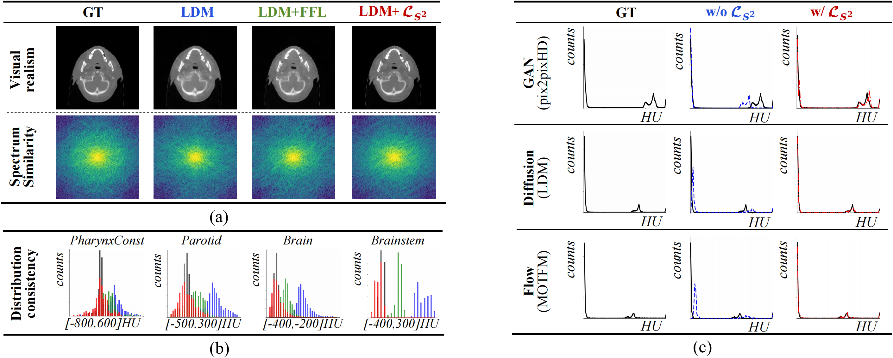
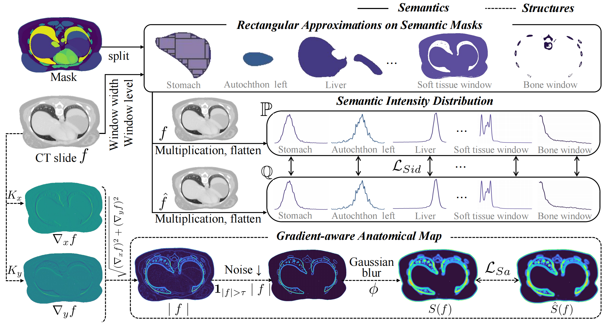
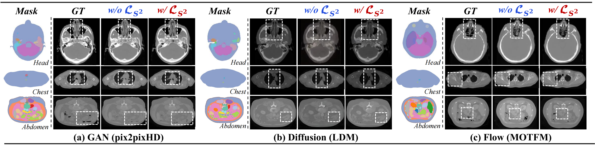

# Semantics-and-Structure-Loss-for-CT-synthesis

🚩The paper **Rethinking CT Synthesis through Semantics-Structure Alignment** has been accepted by NeurIPS 2026.

## 🩻 Problem

Existing CT synthesis methods can generate visually plausible images, but they often treat all tissues uniformly and mainly optimize global pixel-, latent-, or frequency-level consistency. This can lead to two clinically important failure modes:

- **Semantic misalignment:** tissue-specific Hounsfield Unit (HU) distributions are not faithfully preserved.
- **Structural hallucination:** anatomical boundaries and unlabeled structures may be distorted, missing, or implausible.

We therefore rethink CT synthesis as a **semantics–structure alignment problem**, rather than only a visual realism problem. 

  

## 🧠 Method

We propose **Semantics and Structure Loss (LS²)**, a plug-and-play CT-specific objective that jointly aligns **tissue-specific HU distributions** and **anatomical structures**.

LS² contains two complementary components:

- **Semantic Intensity Distribution Loss:** aligns HU distributions in clinically meaningful semantic subspaces.
- **Structural Anatomy Loss:** regularizes gradient-based anatomical structures to reduce structural hallucination.

LS² can be directly integrated into GAN, diffusion, flow-matching, and 3D foundation-model-based CT synthesis frameworks. 

  

---

## 📈 Results

Across **GAN, diffusion, flow, and 3D foundation models**, LS² consistently improves CT synthesis in terms of **intensity fidelity, anatomical structure, semantic HU distribution, and frequency consistency**, while introducing **no additional inference overhead**.

  

